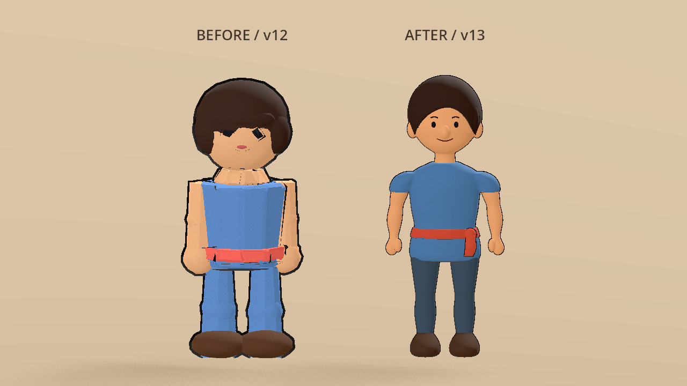
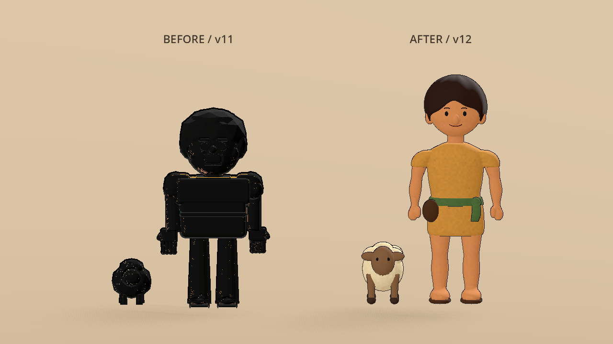

# Little Light — David & Goliath P0.2 (Godot slice)

Vertical slice: Wonder-Walker explores a Bethlehem valley diorama, finds three Wonder Items, meets David (Band A), plays **Steady Hands**, then reflects with Joshua 1:9 (WEB). No violence is shown. Wonder-Walker is a **guest**, not David.

**Engine:** project configuration declares Godot **4.7** (Forward+). Compatibility with older 4.x versions has not been verified.

## Open & run

1. Open Godot matching the **4.7** version declared in `project.godot`.
2. **Import** → choose `project.godot` in this folder (`little-light-godot/`).
3. Wait for the GLB assets to finish importing (see the current asset list below).
4. Press **F5** (main scene: `res://scenes/main.tscn`).

## Controls

| Action        | Key   | Notes                                      |
|---------------|-------|--------------------------------------------|
| Move          | WASD / arrows | Camera-relative; avatar faces move direction |
| Continue      | Space / Enter | Advance dialogue                         |
| Breathe       | Space / Enter | Complete Steady Hands with one tap       |
| Interact      | E     | Collect Wonder Item when near stone/staff/lamb |

## What you'll play through

1. **Arrive** — Wonder Light dialogue text (Space or Enter to continue)
2. **Explore** — find 3 Wonder Items (stone / staff / lamb meshes), press **E**
3. **Meet David** — Band A auto line (no reply choices)
4. **Steady Hands** — press **Space** once (Band A; always succeeds)
5. **Resolution** — narrated off-screen; no fight
6. **Reflect** + **Joshua 1:9** + “Don't. Be. Afraid.”
7. **Courage charm** — animated placeholder bracelet/charm ceremony, followed by chapter completion and free movement

## Current scene assets

`scenes/main.tscn` loads these assets; older versions remain in `assets/` for reference.

| Scene role | Asset |
|------------|-------|
| Wonder-Walker | `assets/wonder_walker_v13.glb` |
| Bethlehem valley | `assets/bethlehem_valley_v7.glb` |
| David mentor | `assets/david_mentor_v12.glb` |
| Wonder Items | `assets/wonder_items_v7.glb` |
| Animated stream | `assets/bethlehem_stream_fish_alive_v7.glb` |

## Project layout

```
little-light-godot/
  project.godot
  scenes/main.tscn
  scripts/
    wonder_walker.gd
    steady_hands_minigame.gd
    chapter_director.gd
    camera_director.gd
    tabletop_camera.gd
    charm_award.gd
    audio_director.gd
  assets/                # GLB models, textures, and shaders
  art/blender/           # Asset generators and pipeline documentation
  art/previews/          # Saved valley renders
  tests/                 # Headless smoke test and screenshot helper
```

## Notes / placeholders

- Valley, WW, David mentor, and wonder-item meshes are placeholder GLBs.
- Safety floor under the diorama so the player cannot fall forever.
- Tabletop camera is a `Camera3D` sibling of the player under `Main`. It follows from above/behind without inheriting the player's rotation; `CameraDirector` switches to a separate close-up camera for dialogue and the charm ceremony.
- Courage charm uses procedural placeholder 3D meshes with a float/snap animation. A persistent Faith Journal is not implemented.
- Dialogue and narration are displayed as text. `AudioDirector` generates procedural sound effects; recorded voiceover plays only when clips are assigned to its currently empty `vo_clips` dictionary.


## Band notes
- **Band A Steady Hands:** 1 Space tap (locked design — auto-succeed).
- Band B multi-tap can raise `taps_required` later.

- Historical Wonder-Walker **v3** introduced paper-grain material and a 12fps step walk animation; the scene now loads **v13**.

## Controls tip
WASD is **camera-relative** (W walks toward the top of the screen). Movement unlocks after the first Space on Arrive. Arrows also work.

## Lighting
Target: soft **paper-warm** diorama (not harsh studio). Lower sun, strong warm ambient, soft shadows, ACES tonemap.

## Collision
Valley + David meshes bake **trimesh StaticBody** colliders at runtime so the walker cannot pass through solids.


## Valley polish (v3)
- Paper-craft cypress + olive trees, shrubs, and rocks on the Judean hills silhouette.
- Flat matte materials + inverted-hull outlines (same paper-diorama look).
- Center play space kept mostly clear for roaming.


## Valley v6 and historical outline fixes

The scene now uses **valley v7**, which is v6 with new trees, bushes and rocks (leafy olives and cypress columns; leafy shrubs; stone-textured rocks in four
variants, one mossy) — see `art/blender/scripts/polish_valley_v7.py`. Character and prop versions are listed above.
`bethlehem_valley_v6.glb` is sculpted terrain
(valley floor, walls, back ridge, a cliff shelf) with the river carved into it
— an upper reach, a waterfall, a plunge pool and a lower reach — rather than
props laid on a flat slab. The character/prop `_v6` files are the v4/v5 models
with their outline hulls rebuilt: the old Solidify hulls rendered in Godot as
an opaque shell that made every character a black silhouette. Both are
generated from `art/blender/scripts/` — see that folder's README.

`SafetyFloor` sits at y=-2.5 because the riverbed is carved below y=0; at its
old y=-0.5 its top face capped the channel.

## Verification helpers

After the assets have been imported, run the existing gameplay smoke test from the project folder:

```sh
godot --headless --path . --script tests/smoke_test.gd
```

This checks chapter progression, item collection, minigame behavior, and camera/companion wiring. It does not validate rendered appearance.

### Offscreen screenshots (Linux virtual display)

`tests/screenshot_autoload.gd` saves the real Forward+ frame to
`/tmp/godot_screenshot.png`. Register it temporarily as an autoload in
`project.godot`:

```
[autoload]

ScreenshotHelper="*res://tests/screenshot_autoload.gd"
```

then run under a virtual display (`xvfb-run -a -s "-screen 0 1280x720x24" godot
--path . scenes/main.tscn`; software Vulkan via `mesa-vulkan-drivers` is
enough). `HIDE_NODE`, `CAM_POS`, `CAM_LOOK` and `SHOT_FRAME` steer the capture
— `HIDE_NODE` in particular is how you find out what is actually drawing at a
pixel. Remove the autoload again before committing.

## Alive stream pack

`assets/bethlehem_stream_fish_alive_v7.glb` is instanced as `StreamFishAlive/Art` on the west stream bank. The `StreamFishAlive` parent is positioned at `(-6.2, 0.28, -3.8)` with uniform scale `1.1`. Runtime scripts fit the waterfall, hide static valley water/fish meshes, and animate procedural fish along the stream. Water meshes skip collision via `mesh_collision_baker.gd`.

**Import gotcha (fixed):** `bethlehem_stream_fish_alive_v6.glb.import` and
`_v7.glb.import` were missing the closing quote on their `uid=` line. A
malformed `.import` file like this sends Godot's editor filesystem scan
into a reimport-retry loop that never finishes on project open — it looks
like a hang, not an error. If a future asset's `.import` file gets
hand-edited or generated by a script that isn't careful about quoting,
this is the first thing to check.

## Historical art notes: Wonder-Walker v8

The v8 iteration used `assets/wonder_walker_v8.glb` (solid hair crown for top-down read), with `WW_Walk` at 12fps STEP and `remove_immutable_tracks=false`. It has since been superseded by v13 in the main scene.

## Wonder-Walker v13: connected body and natural proportions

The main scene uses `assets/wonder_walker_v13.glb`, generated by
`art/blender/scripts/characters/generate_wonder_walker_v5.py`. The Walker has
continuous arm/wrist/palm surfaces, integrated thumbs, a tunic with sloped
shoulders, tapered trouser legs, smaller shoes, and a shaped jaw/cheek/nose
surface. The scalp cap and facial features follow the same head bone.
Outline thickness is reduced from 10 mm to 2.8 mm.

Explicit skin weights blend elbows and knees and keep the body and outline
moving together. The existing 14-bone layout and `WW_Walk` name are preserved;
the walk holds 12 poses per second, closes on a duplicate endpoint, and adjusts
pelvis height to keep the lowest shoe near the floor. Walker v12 remains
available for comparison. See the [Blender README](art/blender/README.md#latest-character)
for regeneration and review commands.



## Historical character generation: Wonder-Walker v12 + David mentor v9

The earlier v4 Walker and v3 props generators output `wonder_walker_v12.glb`,
`david_mentor_v9.glb`, and `wonder_items_v7.glb`. The main scene now uses Walker v13, David v12, and items v7. Use the newer character generators for the active Walker and David assets. These earlier generated versions replaced `wonder_walker_v10/v11.glb`
and `david_mentor_v7/v8.glb` (PR #23's original bot-generated swap, which
had no committed generator script and regressed badly — see below).

Both characters' torsos are now a tapered, beveled cylinder instead of a
beveled cube, so the body reads as a soft rounded human shape ("DOGWALK
style") rather than "blocks stacked together"; both also got a low front
hair fringe + side hair so the face reads as framed instead of a bald
dome, and a short, visibly-narrower **neck** instead of the head sitting
flush on (and slightly sunk into) the torso top. The lamb (David's
companion sheep and the collectible `WonderItem_Lamb`) was rebuilt with
an elongated body, properly-splayed legs, smoother overlapping wool, and
a tail. Generators:
`art/blender/scripts/characters/generate_wonder_walker_v4.py` and
`art/blender/scripts/props/generate_david_and_items_v3.py` — see that
folder's README for the technical gotchas found while building this
(hair detaching during animation, eyebrow/crown clearance margins, the
"Roblox rigid" elbow fix).

**Wonder-Walker's arm/leg joints now actually bend.** The elbow was
rigged (`UpperArm` + `LowerArm` bones) since v3 but the walk cycle never
animated `LowerArm`, so the whole arm swung as one rigid rod pivoting only
at the shoulder — the single biggest thing that made the character read
as stiff/"Roblox" instead of DOGWALK-smooth. `walk()` now animates the
elbow every keyframe (a resting bend that's never fully straight, plus a
fraction of the shoulder swing), and both the elbow and knee got small
volume bulges centered on the joint so they read as actual hinges. Legs
already had two animated bones (hip+knee) since v3 and just needed the
same volume treatment.

**David and the Wonder-Walker turn to face each other.** David's
orientation used to be static (whatever `main.tscn` happened to bake in),
so the close-up camera composed around whatever direction he was
originally facing rather than toward you. `chapter_director.gd`'s
`_face_player()` now smoothly turns him to face the player when
`Beat.MEET_DAVID_A` begins, **awaited before** the camera cuts to the
close-up — `CameraDirector._place_closeup()` reads the target's *current*
facing to compose the shot, so cutting mid-turn (or before it starts)
frames the wrong spot. The turn plays out on the wide tabletop shot
first, then the close-up cuts in already correctly framed. `_face_david()`
turns the Wonder-Walker toward David at the same time (fired without
awaiting it — nothing downstream reads *his* facing, unlike David's), so
it's genuinely face to face on both sides, not just David turning.

**Neck geometry fixed again — the first pass still looked stacked.** A
visibly-narrower neck cylinder wasn't enough on its own: the base radius
was only ~35-40% of the torso-top width, so there was a sharp step from a
wide flat torso top straight down to a narrow post, which reads as a
separate part stacked on top regardless of how smooth the neck's own
surface is. Now tapers from ~60% of the shoulder width instead. Both
characters also got a gentle default smile (small raised mouth corners)
instead of a flat oval that read as a blank stare — see
`art/blender/README.md` for both, including why the smile is a static
default and not a per-context expression system yet.

## David mentor v12: young shepherd

David uses `assets/david_mentor_v12.glb`, generated by
`art/blender/scripts/characters/generate_david_mentor_v4.py`. It shares Walker
v13's continuous body/limb construction, with a golden tunic, green sash,
leather sling pouch, sandals, a soft hair cap, and a closed smile. The companion
lamb is rebuilt in the same style. The model is static; the chapter director
still turns David toward the player, and the charm ceremony supplies his nod.

V11's dark overlapping shell and boxed mouth are replaced at the asset level.
The main scene no longer attaches `FixDavidMentorVisuals`; its old node-hiding
workaround is unnecessary. Thin, single-sided outline hulls are included in
the new GLB, with no mouth-interior, teeth, or tongue surfaces. The close-up
camera has slightly more headroom for the taller model.

Run `godot --headless --path . --script tests/david_visual_review.gd` to check
materials, active asset, collisions, turning and dialogue camera transitions.
Omit `--headless` for before/after renders and actual dialogue screenshots.



## Courage charm award

After Joshua 1:9 / "Don't. Be. Afraid.", beat `CHARM_AWARD` plays a placeholder bracelet+charm float-snap ceremony (`scripts/charm_award.gd`). Swap meshes later with authored art.

## Historical art notes: stream fish alive v2

The v2 iteration used `assets/bethlehem_stream_fish_alive_v2.glb` with a taller cascade and stronger hop/splash/fish wiggle at 12fps STEP. Its parent transform was `(-6.5, 0.05, -4.0)` with scale `1.15`. The current v7 asset and placement are documented under **Alive stream pack** above.
